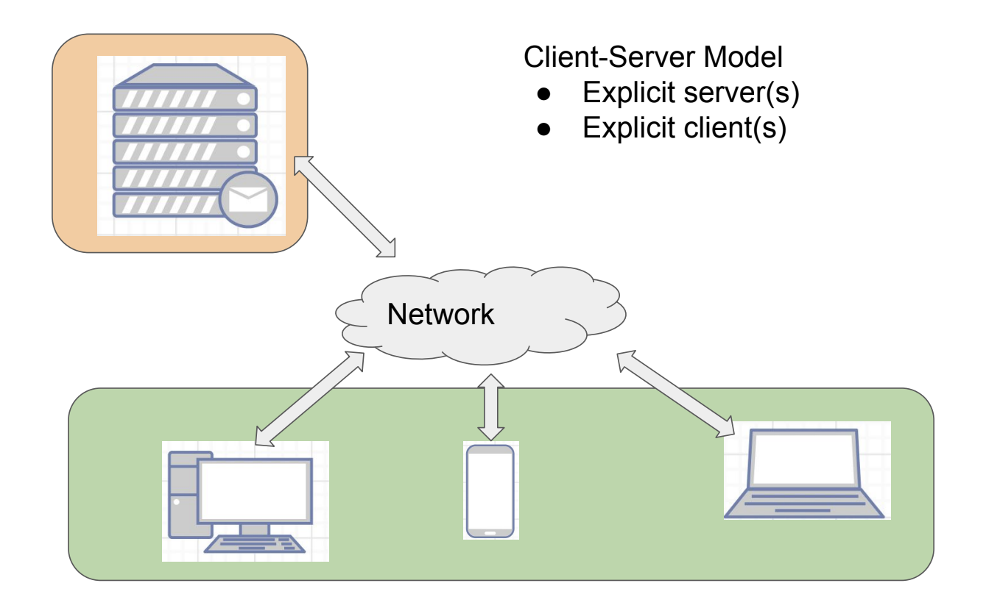
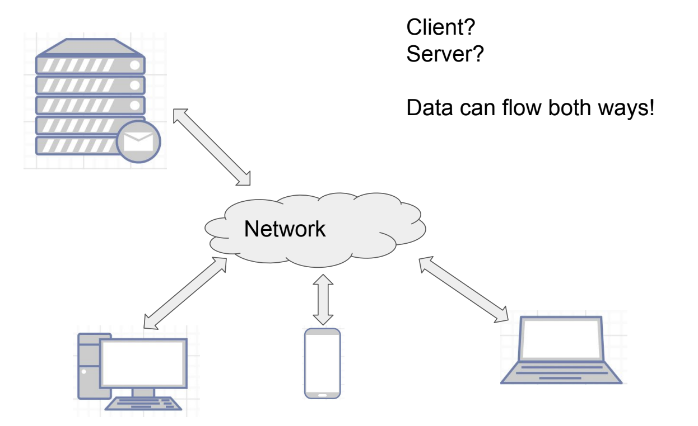

# Architectures of Platforms.

For web apps, an architecture means how are devices connected over the network.

There are mainly two types of web apps namely,

- Client-Server Architecture
- Peer-2-Peer Architecture

## Client Server Architecture

- There is an explicit difference between the server and the client
- Machine clients are also available that do not need a user interaction to perform its task.
- There are several other variants of this architecture, i.e., multiple server, multiple client, multiple queue, etc.

- Examples: Emails, Messaging Apps, etc.

A pictoral representation of client-server architecture is given below.

<figure markdown>
  
  <figcaption>Client Server Model</figcaption>
</figure>

## Peer to Peer Architecture (P2P Model)

- All the devices connected to P2P are given same priority but some peers marked by masters are given higher priority.
- There are not owners of the network but masters or moderators are always present.
- The files are still encrypted with keys to only the owner.
- The information is shared.
- Examples: Web-3, Torrent Clients, IPFS, etc.

A pictoral representation of peer-2-peer architecture is given below.

<figure markdown>
  
  <figcaption>P2P Model</figcaption>
</figure>
