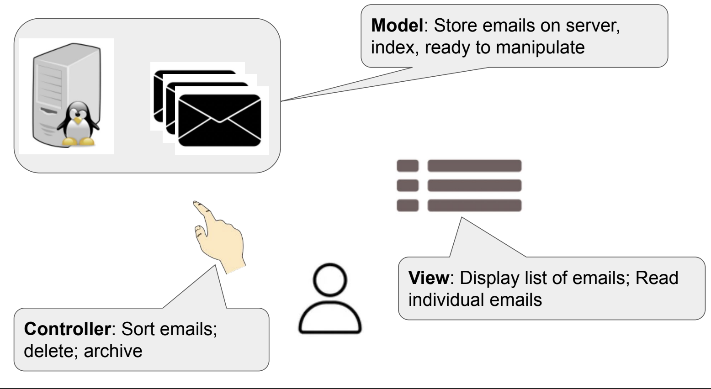

# Software Architecture Patterns

## What is a design pattern?

> "In software engineering, a design pattern is a general repeatable solution to a commonly occurring problem in software design.".

- Senior developers observe a "pattern" in the code and helps the juniors to get their hands-on to the pattern so that the code becomes cleaner and efficient.

## MVC Paradigm (Model-View-Controller Paradigm)

- Model: The core data stored for the application, e.g., databases.
- View: The front-end for your application that the user uses.
- Controller: The manipulation of data.

> User uses the **controller** to manipulate **model** that updates **view**.

- Example:
<figure>
  
  <figcaption>MVC Paradigm when using Email Client</figcaption>
</figure>
